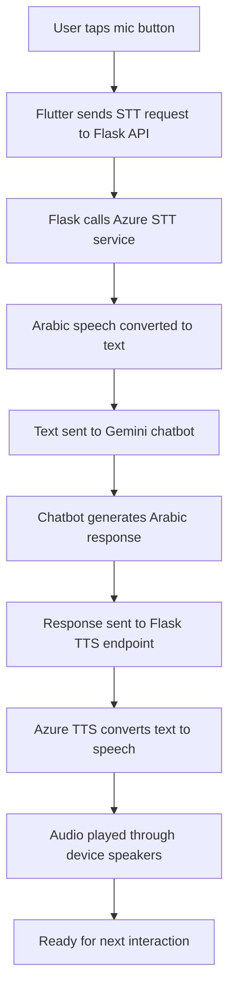

# 🎙️ Arabic Voice Interaction Setup

This guide will help you set up the complete voice interaction system that combines Azure Speech Services with your Flutter first aid chatbot.

## 🌟 **Features**

- **🎤 Speech-to-Text (STT)**: Convert Arabic speech to text using Azure STT
- **🔊 Text-to-Speech (TTS)**: Convert Arabic text responses to speech
- **💬 Voice Conversations**: Complete voice interaction cycles with the chatbot
- **🇲🇦 Arabic Support**: Optimized for Moroccan Arabic (Darija)
- **📱 Flutter Integration**: Beautiful UI with voice animations
- **🔄 Real-time Processing**: Live voice interaction with visual feedback

## 📁 **Files Created**

### Python Backend (ATLAS_APP/)
1. **`azure_stt.py`** - Azure Speech-to-Text service
2. **`azure_voice_service.py`** - Combined TTS + STT service
3. **`flask_voice_api.py`** - Flask API server for Flutter integration
4. **`start_voice_server.py`** - Easy startup script
5. **`requirements.txt`** - Updated with Flask dependencies

### Flutter Frontend (ATLAS/lib/)
1. **`voice_chat_page.dart`** - Voice interaction page
2. **`main.dart`** - Updated with voice chat navigation
3. **`pubspec.yaml`** - Added HTTP dependency

## 🚀 **Quick Setup**

### Step 1: Install Python Dependencies
```bash
cd ATLAS_APP
pip install -r requirements.txt
```

### Step 2: Set Azure Credentials
```powershell
# Windows PowerShell
$env:AZURE_SPEECH_KEY="your_subscription_key_here"
$env:AZURE_SPEECH_REGION="your_region_here"
```

### Step 3: Start Voice API Server
```bash
python start_voice_server.py
```

### Step 4: Install Flutter Dependencies
```bash
cd ../ATLAS
flutter pub get
```

### Step 5: Run Flutter App
```bash
flutter run
```

## 🎯 **How to Use**

1. **Open the app** and tap on **"المحادثة الصوتية"** (Voice Chat)
2. **Tap the microphone button** to start voice interaction
3. **Speak in Arabic** about your first aid question
4. **Listen to the response** - the app will speak back in Arabic
5. **Continue the conversation** by tapping the mic again

## 🔧 **Voice Interaction Flow**



## 🎭 **Voice Options**

The system supports multiple Arabic voices:

### Male Voices
- **ar-MA-JamalNeural** (Moroccan Arabic) - Default
- **ar-SA-HamedNeural** (Saudi Arabic)

### Female Voices  
- **ar-MA-MounaNeural** (Moroccan Arabic)
- **ar-SA-ZariyahNeural** (Saudi Arabic)

## 🛠️ **API Endpoints**

The Flask server provides these endpoints:

| Endpoint | Method | Description |
|----------|--------|-------------|
| `/health` | GET | Health check |
| `/test-setup` | GET | Test Azure services |
| `/speech-to-text` | POST | Convert speech to text |
| `/text-to-speech` | POST | Convert text to speech |
| `/voice-conversation` | POST | Complete conversation cycle |
| `/set-voice` | POST | Change TTS voice |
| `/available-voices` | GET | List available voices |

## 🎨 **Flutter UI Features**

### Visual Feedback
- **🎤 Listening Animation**: Pulsing wave effect while recording
- **🔊 Speaking Animation**: Scaling pulse while playing audio  
- **⏳ Processing Indicator**: Loading animation during AI processing

### Status Messages
- **"أستمع إليك..."** - While recording user speech
- **"أفكر في الإجابة..."** - While processing with AI
- **"أتحدث معك..."** - While playing response audio

### Arabic RTL Support
- **Right-to-left text direction** for Arabic responses
- **Markdown formatting** support for bold text
- **Proper Arabic typography** with Amiri font

## 🔍 **Testing Your Setup**

### Test 1: Environment Check
```bash
python -c "import os; print('Key:', 'Set' if os.getenv('AZURE_SPEECH_KEY') else 'Missing'); print('Region:', os.getenv('AZURE_SPEECH_REGION') or 'Missing')"
```

### Test 2: Azure Services
```bash
python -c "from azure_voice_service import create_voice_service_from_env; vs = create_voice_service_from_env(); print('Setup:', 'OK' if vs else 'Failed')"
```

### Test 3: Flask API
```bash
curl http://localhost:5000/health
```

### Test 4: Voice Services
1. Start the server: `python start_voice_server.py`
2. Visit: `http://localhost:5000/test-setup`
3. Should show all tests passing

## ❗ **Troubleshooting**

### Common Issues:

1. **"Voice service not initialized"**
   - Check Azure environment variables are set
   - Verify your Azure Speech Service is active

2. **"Connection refused" (Flutter → Flask)**
   - Make sure Flask server is running on port 5000
   - Check firewall settings

3. **"No speech detected"**
   - Check microphone permissions
   - Test with `python azure_stt.py` directly
   - Ensure you're speaking clearly in Arabic

4. **"Audio not playing"**
   - Check system audio settings
   - Test with `python azure_tts.py` directly
   - Verify speakers are working

5. **Flutter build errors**
   - Run `flutter clean && flutter pub get`
   - Check all imports are correct
   - Ensure `http` package is installed

## 🌍 **Language Configuration**

The system is configured for **Arabic (Morocco) - ar-MA** by default, which works well for Darija. You can change this by modifying:

```python
# In azure_voice_service.py
self.stt.set_language("ar-SA")  # For Standard Arabic
self.tts.set_voice("ar-SA-ZariyahNeural")  # For Standard Arabic voice
```

## 📊 **Performance Tips**

- **Keep responses short** - Voice interactions work best with concise answers
- **Speak clearly** - Azure STT works better with clear pronunciation
- **Wait for completion** - Let each audio finish before speaking again
- **Good microphone** - Use a quality microphone for better recognition

## 🔒 **Security Notes**

- **API Keys**: Never commit Azure keys to version control
- **Local Server**: Flask server runs locally for security
- **CORS**: Configured only for Flutter app communication

## 📈 **Next Steps**

Possible enhancements:
- **Offline mode** with local speech models
- **Voice authentication** for personalized responses
- **Multi-language support** (French, English)
- **Voice shortcuts** for common first aid scenarios
- **Audio recording** for later playback

---

## 🎉 **You're All Set!**

Your Arabic voice interaction system is now ready! Users can have natural voice conversations with the first aid chatbot in Arabic, making emergency assistance more accessible and intuitive.

**Happy voice chatting! 🎙️✨**

